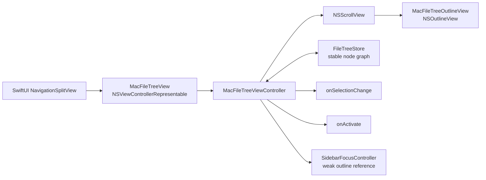

# macOS 네이티브 파일 트리 사이드바 조사 및 iTex 적용 가이드

> 조사일: 2026-07-29  
> 대상: iTex macOS 14+, Swift 5.9, SwiftUI 앱 안의 파일 트리 사이드바  
> 목적: 선택 실패와 포커스 불안정을 근본적으로 없애기 위한 오픈소스 참고자료 및 Codex 구현 인계서

## 한 줄 결론

iTex의 macOS 파일 트리는 SwiftUI `List + DisclosureGroup`를 계속 보정하기보다, **전용 `NSOutlineView`를 `NSViewControllerRepresentable`로 감싸는 구조로 교체하는 것이 가장 안전하다.**

가장 좋은 조합은 다음과 같다.

1. **CodeEdit**에서 SwiftUI 앱 안에 AppKit 프로젝트 내비게이터를 넣는 전체 구조를 가져온다.
2. **VimR**에서 `NSTreeController`, 안정적인 노드 identity, 선택 보존, 직접 first-responder 전환을 가져온다.
3. **NetNewsWire**에서 reload 전후 선택 복원, 컨텍스트 메뉴의 clicked row 처리, focus API 패턴을 가져온다.
4. **TextMate**에서 파일 변경 중 포커스가 사라졌을 때 복구하는 패턴만 학습한다. GPLv3이므로 코드를 그대로 복사하지 않는다.

단일 라이브러리를 그대로 설치하는 것보다 위 패턴을 작은 iTex 전용 AppKit 컴포넌트로 구현하는 편이 유지보수와 라이선스 측면에서 낫다.

---

## Codex에게 바로 전달할 작업 지시

아래 내용은 이 문서를 읽은 Codex가 따라야 할 구현 목표다.

> `docs/macos-native-file-tree-sidebar-research.md`를 먼저 끝까지 읽고, 현재 `Sources/ContentView.swift`의 macOS `SidebarView`를 전용 `NSOutlineView` 기반 구현으로 교체한다. CodeEdit의 representable/controller 경계, VimR의 stable node + `NSTreeController.preservesSelection`, NetNewsWire의 selection save/restore와 직접 focus reference를 우선 참고한다. 기존 파일 작업, FSEvents, Quick Look 스타일 preview, 열기 콜백은 가능한 한 유지한다. 단일 클릭은 선택만, 더블 클릭/Return은 열기 또는 폴더 토글, Space는 preview로 분리한다. 창의 첫 번째 `NSTableView`를 검색하는 코드는 제거하고 실제 outline view reference를 focus coordinator에 등록한다. 구현 후 이 문서의 acceptance test를 자동/수동 검증한다. TextMate 코드는 GPLv3이므로 직접 복사하지 않는다.

---

## 1. 현재 iTex 구현 진단

관련 코드:

- `Sources/ContentView.swift:600-846` — watcher, 모델, `SidebarView`, 재귀 `FileRow`
- `Sources/LaTeXEditorView.swift:521-540` — 사이드바 포커스 전환
- `Sources/ContentView.swift:960-1023` — preview panel이 선택된 table row를 찾는 코드

### 현재 구조

```text
NavigationSplitView
└─ SwiftUI List(selection:)
   └─ Section
      └─ 재귀 FileRow
         ├─ DisclosureGroup
         ├─ Label
         ├─ .tag(URL)
         ├─ .onDrag
         └─ .onDrop
```

파일 변경 시에는 FSEvents가 `FileTreeModel.version`을 올리고, 열린 모든 폴더 row가 이를 관찰해 각자 디렉터리를 다시 읽는다. 포커스 명령은 창 전체 view tree에서 첫 번째 `NSTableView`를 찾아 first responder로 만든다.

### 선택이 자주 안 되는 원인 후보

확정적인 단일 버그라기보다 여러 취약점이 겹쳐 있다.

1. **계층형 선택을 SwiftUI의 암묵적 동작에 의존한다.**
   `List(selection:)` 내부에 재귀 `DisclosureGroup`이 있고 `.tag(URL)`이 바깥 group 또는 leaf label에 붙는다. 트리 row가 단순 `List` row가 아니므로 실제 AppKit row와 SwiftUI tag의 대응이 불투명하다.

2. **row 안에 drag/drop과 disclosure interaction이 함께 있다.**
   폴더 label에 `.onDrag`와 `.onDrop`이 있고 disclosure triangle도 별도 interaction을 가진다. mouse-down이 선택, drag, disclosure 중 어디로 전달되는지 SwiftUI gesture arbitration에 맡겨져 있다.

3. **행 전체 hit target을 소유하지 않는다.**
   row content가 intrinsic-width `Label`이고, 선택을 직접 처리하는 row-level AppKit view가 없다. 텍스트 오른쪽 빈 공간, 아이콘, disclosure 주변 등 클릭 위치에 따라 다른 하위 view가 event를 받을 여지가 있다.

4. **파일 시스템 변경이 넓은 SwiftUI 재평가를 유발한다.**
   `version` 변경을 열린 모든 `FileRow`가 관찰한다. row별 `@State children`과 선택 binding이 동시에 갱신될 수 있어 선택 highlight와 실제 selection state가 엇갈릴 가능성이 있다.

5. **identity가 “경로 URL 값”과 “새로 만들어지는 SwiftUI value”의 조합이다.**
   rename은 identity 자체를 바꾸며, reload 때마다 `FileEntry` value가 재생성된다. `NSOutlineView`가 요구하는 stable item object와 다르다.

6. **포커스 대상이 명시적이지 않다.**
   `LaTeXEditorView.toggleSidebarFocus()`는 창 안의 첫 번째 `NSTableView`를 사용한다. problems table, completion table, 다른 SwiftUI list가 추가되거나 view 순서가 바뀌면 잘못된 view로 focus가 이동할 수 있다.

7. **first responder 전환 성공 여부를 확인하지 않는다.**
   `NSWindow.makeFirstResponder(_:)`는 현재 responder가 resign을 거부할 수도 있고 대상이 responder를 받지 못할 수도 있다. Apple 문서도 명시적 호출 전 `acceptsFirstResponder` 확인을 권한다. [Apple `makeFirstResponder(_:)`](https://developer.apple.com/documentation/appkit/nswindow/makefirstresponder%28_%3A%29)

8. **preview panel도 동일한 “첫 table 검색”에 의존한다.**
   preview anchor를 잡을 때 first responder가 table이 아니면 다시 window에서 첫 table을 찾는다. 사이드바의 실제 outline reference를 공유하면 제거할 수 있는 취약점이다.

### 설계상 맞는 부분

아래 동작은 유지할 가치가 있다.

- single click/arrow selection과 파일 열기를 분리한 것
- 더블 클릭 또는 Return에서만 open/toggle하는 것
- Space preview가 selection을 따라가는 것
- non-activating child panel로 preview가 keyboard focus를 훔치지 않게 한 것
- FSEvents 기반 외부 변경 감지
- URL 기반 파일 작업과 `onOpen` callback

문제는 기능 정책이 아니라 **트리 컨트롤과 responder ownership이 SwiftUI 내부 구현에 기대고 있다는 점**이다.

---

## 2. 플랫폼 기준: Apple이 권하는 구성

Apple은 파일과 폴더 같은 계층형 데이터를 표시하는 AppKit control로 `NSOutlineView`를 정의한다. 각 item은 고유해야 하며, reload 사이에 collapse state를 유지하려면 동일 item이 동일 pointer/equality를 유지해야 한다. [Apple `NSOutlineView`](https://developer.apple.com/documentation/appkit/nsoutlineview)

사이드바 외형은 직접 색과 spacing을 흉내 내기보다 다음 한 줄을 기준으로 삼는다.

```swift
outlineView.style = .sourceList
```

`sourceList` style은 sidebar의 표준 metrics, selection style, background를 적용하고 outline view의 indentation, row height, intercell spacing도 표준값으로 맞춘다. [Apple `NSTableView.Style.sourceList`](https://developer.apple.com/documentation/appkit/nstableviewstyle/nstableviewstylesourcelist)

Apple HIG의 관련 요구사항:

- outline view는 split view의 leading side에 적합하다.
- 폴더 disclosure를 쉽게 열고 닫을 수 있어야 한다.
- 사용자의 expansion 선택을 보존해야 한다.
- 파일 outline은 single click과 double click에 서로 다른 동작을 줄 수 있다.
- macOS sidebar의 row/icon 크기는 사용자의 시스템 설정을 존중해야 한다.

참고:

- [Apple HIG — Outline views](https://developer.apple.com/design/human-interface-guidelines/outline-views)
- [Apple HIG — Sidebars](https://developer.apple.com/design/human-interface-guidelines/sidebars)
- [Apple — Navigating Hierarchical Data Using Outline and Split Views](https://developer.apple.com/documentation/appkit/navigating-hierarchical-data-using-outline-and-split-views)

---

## 3. 조사 후보 비교

| 우선순위 | 프로젝트 | 형태 | 최근 확인 commit | 라이선스 | iTex 적합성 | 핵심 가치 |
|---|---|---|---|---|---|---|
| 1 | [VimR](https://github.com/qvacua/vimr) | 완성 macOS 편집기, AppKit file browser | 2026-07-26 | MIT | 매우 높음 | stable tree, selection 보존, 명시적 focus, keyboard |
| 2 | [CodeEdit](https://github.com/CodeEditApp/CodeEdit) | SwiftUI+AppKit macOS 편집기 | 2025-12-14 | MIT | 매우 높음 | iTex와 가장 비슷한 representable/controller 경계 |
| 3 | [NetNewsWire](https://github.com/Ranchero-Software/NetNewsWire) | 완성 macOS 앱, AppKit hierarchical sidebar | 2026-07-25 | MIT | 높음 | reload selection 복원, focus, context selection |
| 4 | [TextMate](https://github.com/textmate/textmate) | 완성 macOS 편집기, AppKit file browser | 2021-10-12 | GPLv3 | 학습용 높음, 복사 부적합 | 오랜 실전 file browser, refresh 중 focus 복구 |
| 5 | [Sameesunkaria/OutlineView](https://github.com/Sameesunkaria/OutlineView) | SwiftPM `NSOutlineView` wrapper | 2023-02-02 | MIT | 중간 | 양방향 selection, tree diff update |
| 6 | [ChimeHQ/Outline](https://github.com/ChimeHQ/Outline) | SwiftPM async/lazy wrapper | 2024-09-14 | BSD-3-Clause | 중간 이하 | async lazy child loading, 작은 코드베이스 |
| 보조 | [Folderium](https://github.com/abdullahguch/folderium) | SwiftUI macOS file manager | 2026-06-07 | MIT | tree에는 낮음 | SwiftUI click 실패를 AppKit mouse overlay로 우회한 사례 |
| 제외 | [dnadoba/Tree](https://github.com/dnadoba/Tree) | tree diff + AppKit data source | 2021-04-04 | 명시 라이선스 없음 | 사용 금지 | identity cache 아이디어만 관찰 |
| 제외 | [Pathem](https://pathem.app/) | AppKit file manager라고 소개 | 2026 사이트 | 사이트상 MIT | 현재 검증 불가 | GitHub 링크가 2026-07-29 현재 404 |

비네이티브 편집기인 VS Code/Electron과 Zed/GPUI는 file-tree UX를 관찰할 수는 있지만, AppKit selection/focus 문제의 참고 소스로는 우선순위를 낮췄다. CotEditor, FSNotes 등은 좋은 네이티브 앱이지만 iTex가 필요한 “프로젝트 파일 트리”와 직접 일치하는 구현이 아니다.

---

## 4. 1순위: VimR

### 왜 가장 좋은가

VimR는 현재도 유지보수되는 macOS 편집기이고, 파일 브라우저가 순수 Swift/AppKit `NSOutlineView`다. iTex가 겪는 세 문제를 한 곳에서 다룬다.

- 파일 시스템 tree
- selection 보존
- editor ↔ file browser focus 이동

### 우선 읽을 파일

1. [`FileOutlineView.swift`](https://github.com/qvacua/vimr/blob/1e7df5a90c2d9239a067f7a4877a54b37f2683c8/VimR/VimR/FileOutlineView.swift)
2. [`FileBrowser.swift`](https://github.com/qvacua/vimr/blob/1e7df5a90c2d9239a067f7a4877a54b37f2683c8/VimR/VimR/FileBrowser.swift)
3. [`AppKitCommons.swift`](https://github.com/qvacua/vimr/blob/1e7df5a90c2d9239a067f7a4877a54b37f2683c8/VimR/VimR/AppKitCommons.swift)
4. [`Commons/AppKitCommons.swift`](https://github.com/qvacua/vimr/blob/1e7df5a90c2d9239a067f7a4877a54b37f2683c8/Commons/Sources/Commons/AppKitCommons.swift)
5. [MIT license](https://github.com/qvacua/vimr/blob/1e7df5a90c2d9239a067f7a4877a54b37f2683c8/LICENSE)

### 가져올 패턴

#### 4.1 `NSTreeController.preservesSelection`

VimR는 tree controller와 outline view selection을 Cocoa Binding으로 연결한다.

```swift
treeController.childrenKeyPath = "children"
treeController.leafKeyPath = "isLeaf"
treeController.countKeyPath = "childrenCount"
treeController.avoidsEmptySelection = false
treeController.preservesSelection = true

treeController.bind(.contentArray, to: self, withKeyPath: "content")
bind(.content, to: treeController, withKeyPath: "arrangedObjects")
bind(.selectionIndexPaths, to: treeController, withKeyPath: "selectionIndexPaths")
```

`preservesSelection`은 content가 바뀔 때 tree controller가 현재 selection을 보존하도록 시도하는 공식 AppKit 기능이다. [Apple `NSTreeController`](https://developer.apple.com/documentation/appkit/nstreecontroller)

#### 4.2 stable reference node

각 filesystem item을 `Node: NSObject` reference로 유지하고 children을 lazy scan한다. SwiftUI value를 매번 다시 만드는 현재 iTex보다 `NSOutlineView`의 identity 요구에 잘 맞는다.

#### 4.3 직접 focus

전역 앱 상태가 `.fileBrowser` focus를 요청하면 실제 `FileOutlineView` 인스턴스에서 `window?.makeFirstResponder(self)`를 호출한다. 창 안의 임의 table을 검색하지 않는다.

#### 4.4 표준 keyboard path

`keyDown(with:)`를 override하되 처리하지 않는 key는 반드시 `super`로 보낸다. Space/Return만 폴더 toggle 또는 파일 open으로 처리하고 화살표 이동은 AppKit에 맡긴다.

#### 4.5 부분 filesystem update

파일 변화가 생기면 변경된 node의 기존 child URL과 새 child URL을 비교해 `NSTreeController.insert/removeObjects`를 호출한다. 전체 tree를 다시 만들지 않는다.

### 그대로 가져오지 않을 부분

- custom theme와 MaterialIcons
- Redux 상태 구조
- `NSTreeController` binding이 iTex에 과하면 conventional data source로 단순화 가능
- 현재 소스의 `changedTreeNode(for:)` path-component 계산은 별도 검증 필요

---

## 5. 2순위: CodeEdit

### 왜 iTex에 가장 쉽게 이식되는가

CodeEdit는 SwiftUI 앱의 Navigator 영역에서 실제 file tree만 `NSViewControllerRepresentable`로 AppKit에 내린다. iTex가 채택해야 할 UI 경계가 거의 동일하다.

```text
SwiftUI ProjectNavigatorView
└─ ProjectNavigatorOutlineView: NSViewControllerRepresentable
   └─ ProjectNavigatorViewController
      ├─ NSScrollView
      └─ NSOutlineView
```

### 우선 읽을 파일

1. [`ProjectNavigatorOutlineView.swift`](https://github.com/CodeEditApp/CodeEdit/blob/cec6287a49a0a460cd7cab17f254eebc3ada828e/CodeEdit/Features/NavigatorArea/ProjectNavigator/OutlineView/ProjectNavigatorOutlineView.swift)
2. [`ProjectNavigatorViewController.swift`](https://github.com/CodeEditApp/CodeEdit/blob/cec6287a49a0a460cd7cab17f254eebc3ada828e/CodeEdit/Features/NavigatorArea/ProjectNavigator/OutlineView/ProjectNavigatorViewController.swift)
3. [`ProjectNavigatorViewController+NSOutlineViewDelegate.swift`](https://github.com/CodeEditApp/CodeEdit/blob/cec6287a49a0a460cd7cab17f254eebc3ada828e/CodeEdit/Features/NavigatorArea/ProjectNavigator/OutlineView/ProjectNavigatorViewController%2BNSOutlineViewDelegate.swift)
4. [`ProjectNavigatorViewController+NSOutlineViewDataSource.swift`](https://github.com/CodeEditApp/CodeEdit/blob/cec6287a49a0a460cd7cab17f254eebc3ada828e/CodeEdit/Features/NavigatorArea/ProjectNavigator/OutlineView/ProjectNavigatorViewController%2BNSOutlineViewDataSource.swift)
5. [`ProjectNavigatorNSOutlineView.swift`](https://github.com/CodeEditApp/CodeEdit/blob/cec6287a49a0a460cd7cab17f254eebc3ada828e/CodeEdit/Features/NavigatorArea/ProjectNavigator/OutlineView/ProjectNavigatorNSOutlineView.swift)
6. [Project Navigator UI tests](https://github.com/CodeEditApp/CodeEdit/tree/cec6287a49a0a460cd7cab17f254eebc3ada828e/CodeEditUITests/Features/NavigatorArea/ProjectNavigator)
7. [MIT license](https://github.com/CodeEditApp/CodeEdit/blob/cec6287a49a0a460cd7cab17f254eebc3ada828e/LICENSE.md)

### 가져올 패턴

#### 5.1 AppKit controller를 SwiftUI에서 소유

`makeNSViewController`에서 workspace와 editor를 주입하고 coordinator가 filesystem observer를 받는다. `updateNSViewController`는 preference와 외부 active-file selection만 동기화한다.

#### 5.2 selection update와 open action의 feedback loop 차단

`shouldSendSelectionUpdate` flag로 다음 두 방향을 구분한다.

- 사용자가 outline row를 선택 → temporary tab open
- 외부 active tab 변경 → outline selection 이동

iTex도 `isApplyingExternalSelection` 같은 flag가 필요하다. 그렇지 않으면 active file을 reveal하기 위한 programmatic selection이 다시 open action을 일으킬 수 있다.

#### 5.3 reload 전후 selected item object 보존

filesystem observer에서 현재 selected item objects를 먼저 저장하고 필요한 item만 reload한 뒤, 새 row index를 계산해 selection을 복원한다.

#### 5.4 inline rename 중 reload 연기

outline 내부 field editor가 first responder인 동안 filesystem update가 오면 reload를 즉시 하지 않고 편집 종료 후 처리한다. rename text field가 사라지는 문제를 막는다.

#### 5.5 clicked row와 selected row 분리

더블 클릭과 context menu는 `clickedRow`, 일반 명령은 `selectedRowIndexes`를 기준으로 한다. 우클릭한 row가 기존 multi-selection에 포함되는지에 따라 대상 집합을 정한다.

### 주의점

- CodeEdit의 일부 selection 함수는 `row == -1` 방어가 일관적이지 않다. iTex에서는 항상 row 범위를 확인한다.
- CodeEdit는 multi-selection과 temporary tab 정책이 있어 iTex보다 복잡하다. 필요한 부분만 줄여서 가져온다.

---

## 6. 3순위: NetNewsWire

파일 브라우저는 아니지만, 오랜 기간 실사용된 macOS hierarchical sidebar다. 특히 selection과 focus 기준 코드가 좋다.

### 우선 읽을 파일

1. [`SidebarViewController.swift`](https://github.com/Ranchero-Software/NetNewsWire/blob/52030006b5a3a45d865bd03a455f85d3f1327077/Mac/MainWindow/Sidebar/SidebarViewController.swift)
2. [`SidebarOutlineView.swift`](https://github.com/Ranchero-Software/NetNewsWire/blob/52030006b5a3a45d865bd03a455f85d3f1327077/Mac/MainWindow/Sidebar/SidebarOutlineView.swift)
3. [`SidebarOutlineDataSource.swift`](https://github.com/Ranchero-Software/NetNewsWire/blob/52030006b5a3a45d865bd03a455f85d3f1327077/Mac/MainWindow/Sidebar/SidebarOutlineDataSource.swift)
4. [MIT license](https://github.com/Ranchero-Software/NetNewsWire/blob/52030006b5a3a45d865bd03a455f85d3f1327077/LICENSE)

### 가져올 패턴

#### 6.1 reload를 selection transaction으로 취급

```text
savedSelection = selectedNodes
rebuild/reload
restore expansion
restoreSelection(savedSelection)
필요할 때만 selectionDidChange 전파
```

reload를 단순 view refresh가 아니라 state transaction으로 취급하는 점이 핵심이다.

#### 6.2 focus는 실제 outline reference로

`focus()`가 `outlineView.window`에 실제 outline view를 직접 전달한다. split view가 collapsed 상태면 focus를 요청하지 않는다.

#### 6.3 descendant가 이미 first responder면 건드리지 않기

outline 내부 inline editor처럼 descendant가 first responder일 수 있으므로, outline 자체만 비교하지 않고 subtree 전체를 고려한다.

#### 6.4 selection proposal을 delegate에서 검증

group row처럼 선택 불가능한 row가 포함되면 기존 selection을 반환한다. AppKit의 공식 `outlineView(_:selectionIndexesForProposedSelection:)` hook을 사용한다. [Apple delegate 문서](https://developer.apple.com/documentation/appkit/nsoutlineviewdelegate/outlineview%28_%3Aselectionindexesforproposedselection%3A%29)

#### 6.5 context menu target

- clicked row가 현재 selection에 포함됨 → 전체 selection 대상
- 포함되지 않음 → clicked row 하나만 대상
- 빈 공간 → row 메뉴 없음

iTex의 file operations에도 그대로 적용할 수 있다.

---

## 7. TextMate: 매우 좋은 학습 자료, GPL 주의

TextMate의 file browser는 별도 `Frameworks/FileBrowser`로 분리되어 있고 FSEvents, rename, drag/drop, Quick Look, selection/expansion 복원까지 포함한다.

### 우선 읽을 파일

1. [`FileBrowserOutlineView.mm`](https://github.com/textmate/textmate/blob/346b52b108b387462d4b3def481fb74983ae89f3/Frameworks/FileBrowser/src/FileBrowserOutlineView.mm)
2. [`FileBrowserViewController.mm`](https://github.com/textmate/textmate/blob/346b52b108b387462d4b3def481fb74983ae89f3/Frameworks/FileBrowser/src/FileBrowserViewController.mm)
3. [`FSEventsManager.mm`](https://github.com/textmate/textmate/blob/346b52b108b387462d4b3def481fb74983ae89f3/Frameworks/FileBrowser/src/FSEventsManager.mm)
4. [`FileItemObserver.mm`](https://github.com/textmate/textmate/blob/346b52b108b387462d4b3def481fb74983ae89f3/Frameworks/FileBrowser/src/FileItemObserver.mm)
5. [GPLv3 license](https://github.com/textmate/textmate/blob/346b52b108b387462d4b3def481fb74983ae89f3/LICENSE)

### 특히 볼 부분

#### 7.1 filesystem row 제거 전후 focus 복구

TextMate는 row removal 직전에 first responder가 outline subtree 안에 있었는지 저장한다. update 후 subtree 밖으로 focus가 밀려났다면 outline view를 다시 first responder로 만든다.

이것이 iTex의 “파일 변경 후 키보드 포커스가 사라지는” 종류의 문제를 막는 정확한 패턴이다.

#### 7.2 selection/expansion을 URL set으로 별도 저장

보이는 row뿐 아니라 아직 로드되지 않은 selection/expansion도 URL set에 유지한다. lazy tree에서도 state가 사라지지 않는다.

#### 7.3 keyboard command는 first responder일 때만

Space Quick Look, Command+O, context menu shortcut 등을 `window.firstResponder == self`일 때만 가로챈다.

### 라이선스 경계

TextMate는 GPLv3이다. iTex가 GPLv3 배포 조건을 채택하려는 것이 아니라면:

- 구조와 동작을 학습하는 것은 가능
- 구체 코드를 복사·변형해 포함하지 말 것
- 실제 구현은 MIT/BSD 소스와 Apple API 문서를 바탕으로 독립 작성할 것

---

## 8. 재사용 패키지 평가

### 8.1 Sameesunkaria/OutlineView

링크:

- [README](https://github.com/Sameesunkaria/OutlineView/blob/661a32c6f6db1bbb4349048e3d0fcb6afa5a9d26/README.md)
- [`OutlineViewController.swift`](https://github.com/Sameesunkaria/OutlineView/blob/661a32c6f6db1bbb4349048e3d0fcb6afa5a9d26/Sources/OutlineView/OutlineViewController.swift)
- [`OutlineViewDelegate.swift`](https://github.com/Sameesunkaria/OutlineView/blob/661a32c6f6db1bbb4349048e3d0fcb6afa5a9d26/Sources/OutlineView/OutlineViewDelegate.swift)
- [`OutlineViewUpdater.swift`](https://github.com/Sameesunkaria/OutlineView/blob/661a32c6f6db1bbb4349048e3d0fcb6afa5a9d26/Sources/OutlineView/OutlineViewUpdater.swift)
- [tests](https://github.com/Sameesunkaria/OutlineView/tree/661a32c6f6db1bbb4349048e3d0fcb6afa5a9d26/Tests/OutlineViewTests)
- [MIT license](https://github.com/Sameesunkaria/OutlineView/blob/661a32c6f6db1bbb4349048e3d0fcb6afa5a9d26/LICENSE.txt)

장점:

- SwiftUI binding ↔ AppKit selection 양방향 동기화
- stable `Identifiable` item wrapper
- full reload 대신 insert/remove diff
- `.sourceList` style 노출
- drag/drop 지원
- row update test가 있음

단점:

- 2023년 이후 commit이 확인되지 않음
- single selection 중심
- cell content가 SwiftUI `View`가 아니라 `NSView`
- macOS 11 row-view leak을 private KVC로 우회하는 코드가 있어 최신 macOS에서는 제거/검증 필요
- lazy async filesystem loading은 제공하지 않음

판정: **prototype 또는 소스 차용에는 좋지만, 그대로 dependency로 추가하기 전에 macOS 14/15/26 빌드와 interaction test가 필요하다.**

### 8.2 ChimeHQ/Outline

링크:

- [README](https://github.com/ChimeHQ/Outline/blob/a432a003a6f6cdf286dff68c66919bc17c9de0bc/README.md)
- [`OutlineView.swift`](https://github.com/ChimeHQ/Outline/blob/a432a003a6f6cdf286dff68c66919bc17c9de0bc/Sources/Outline/OutlineView.swift)
- [`OutlineViewCoordinator.swift`](https://github.com/ChimeHQ/Outline/blob/a432a003a6f6cdf286dff68c66919bc17c9de0bc/Sources/Outline/OutlineViewCoordinator.swift)
- [`OutlineViewModel.swift`](https://github.com/ChimeHQ/Outline/blob/a432a003a6f6cdf286dff68c66919bc17c9de0bc/Sources/Outline/OutlineViewModel.swift)
- [BSD-3-Clause license](https://github.com/ChimeHQ/Outline/blob/a432a003a6f6cdf286dff68c66919bc17c9de0bc/LICENSE)

장점:

- 코드가 작고 이해하기 쉬움
- async lazy child loading
- SwiftUI row content를 `NSHostingView`로 넣음
- expansion binding 지원
- stable ID를 가진 reference node

단점:

- 외부 selection binding 변경을 `NSOutlineView`에 다시 적용하는 코드가 없음
- persistent item delegate 구현이 주석 처리되어 있음
- focus API가 없음
- filesystem 변경 diff가 아니라 `reloadItem`
- AppKit selection의 text tint가 SwiftUI `Text`에 자연스럽게 적용되지 않을 수 있음
- 2024년 이후 commit이 확인되지 않음

판정: **lazy-loading model 참고용. iTex의 선택/포커스 문제를 해결하는 완제품으로는 부족하다.**

### 8.3 dnadoba/Tree

stable reference cache와 tree diff → `insertItems/removeItems/moveItem` 변환은 유용한 아이디어다. 그러나 repository에 명시적 license file이나 package license declaration이 확인되지 않았고 마지막 commit도 2021년이므로 코드 사용 후보에서 제외한다.

---

## 9. 보조 사례: Folderium

Folderium은 tree가 아니라 flat file list 중심이라 최종 구조의 참고본은 아니다. 다만 SwiftUI row의 click이 불안정해졌을 때 어떻게 AppKit으로 내려갔는지 보여준다.

관련 파일:

- [`DualPaneView.swift`](https://github.com/abdullahguch/folderium/blob/522ea3df41d0515085fe09d3913fb001005eb836/Folderium%20App/Folderium/DualPaneView.swift)
- [MIT license](https://github.com/abdullahguch/folderium/blob/522ea3df41d0515085fe09d3913fb001005eb836/LICENSE)

Folderium은 row 전체에 투명 `NSViewRepresentable` overlay를 두고:

- `acceptsFirstMouse`를 `true`로 설정
- `mouseDown`에서 modifier와 click count를 직접 읽음
- selection과 double click을 분리
- 우클릭은 다음 responder로 보내 SwiftUI context menu를 유지

한다.

이 코드는 “SwiftUI gesture를 더 붙이면 언젠가 해결된다”가 아니라, 결국 mouse event ownership을 AppKit에 명시해야 했다는 실전 증거다. 다만 iTex는 overlay hack보다 전체 row/selection을 원래 소유하는 `NSOutlineView`로 가는 편이 단순하다.

---

## 10. iTex 권장 아키텍처

### 10.1 파일 구성

macOS 전용 코드를 현재의 큰 `ContentView.swift`에서 분리하는 편이 좋다.

```text
Sources/
├─ Sidebar/
│  ├─ FileTreeNode.swift
│  ├─ FileTreeStore.swift
│  ├─ MacFileTreeView.swift
│  ├─ MacFileTreeViewController.swift
│  ├─ MacFileTreeOutlineView.swift
│  ├─ MacFileTreeDataSource.swift
│  ├─ MacFileTreeDelegate.swift
│  ├─ SidebarFocusController.swift
│  └─ SidebarFileOperations.swift
└─ ContentView.swift
```

프로젝트가 작은 상태에서는 파일 수를 줄여도 되지만, 최소한 model/store, controller/outline, SwiftUI wrapper는 분리하는 것이 좋다.

### 10.2 view 경계



### 10.3 stable node

```swift
@MainActor
final class FileTreeNode: NSObject {
    let identity: FileIdentity
    private(set) var url: URL
    private(set) var name: String
    private(set) var isDirectory: Bool
    weak var parent: FileTreeNode?
    var childrenState: ChildrenState
}
```

identity 우선순위:

1. 가능하면 file resource identifier
2. fallback은 standardized file URL

rename 때 node object를 가능한 한 유지하고 URL/name을 갱신한다. 삭제 후 같은 경로에 새 파일이 생긴 경우는 새 identity로 취급할지 정책을 명시한다.

### 10.4 selection과 activation을 분리

```text
single click / arrow
└─ selection만 변경

double click / Return
├─ directory → expand/collapse
└─ file → onOpen

Space
└─ 현재 selection preview toggle
```

AppKit delegate의 selection notification에서 파일을 바로 열지 않는 것이 iTex의 현재 정책과 맞다.

### 10.5 focus ownership

`SidebarFocusController`가 실제 outline view를 weak reference로 가진다.

```swift
@MainActor
final class SidebarFocusController: ObservableObject {
    weak var outlineView: NSOutlineView?

    func focus() -> Bool {
        guard let outlineView,
              let window = outlineView.window,
              outlineView.acceptsFirstResponder
        else { return false }

        return window.makeFirstResponder(outlineView)
    }
}
```

editor의 `⌘⇧E`는 view tree를 검색하지 않고 이 controller를 호출한다. focus가 이미 outline의 descendant, 예를 들어 inline rename field editor에 있다면 outline 자체로 강제 이동하지 않는다.

### 10.6 filesystem update

권장 순서:

1. 변경된 경로를 watcher에서 받음
2. 영향받은 parent node를 찾음
3. 기존 child identities와 새 directory listing diff
4. selected identities와 first-responder 위치 저장
5. `beginUpdates`
6. insert/remove/move/reload
7. `endUpdates`
8. selection과 expansion 검증/복원
9. update 전 focus가 outline subtree였는데 update 후 빠졌을 때만 outline focus 복구

Apple은 `reloadItem(_:reloadChildren:)`에서 닫힌 item의 children까지 reload하는 것은 불필요하고 비효율적이라고 명시한다. [Apple reload 문서](https://developer.apple.com/documentation/appkit/nsoutlineview/reloaditem%28_%3Areloadchildren%3A%29)

또한 `reloadItem(_:)`이 delegate notification 없이 selection을 바꿀 수 있다고 문서화되어 있으므로, reload 후 selection을 명시적으로 검증해야 한다. [Apple `reloadItem(_:)`](https://developer.apple.com/documentation/appkit/nsoutlineview/reloaditem%28_%3A%29)

### 10.7 expansion persistence

두 방법 중 하나를 택한다.

1. `autosaveExpandedItems = true`, `autosaveName` 설정, persistent-object delegate 구현
2. app state에 expanded `FileIdentity` set 저장

첫 번째 방법은 delegate 양쪽을 구현하지 않으면 무시된다. [Apple `autosaveExpandedItems`](https://developer.apple.com/documentation/appkit/nsoutlineview/autosaveexpandeditems)

iTex는 root project별 state가 필요하므로 `autosaveName`에 standardized root path hash를 포함하거나, 기존 `SidebarExpansion`을 stable ID 기반 persistent store로 바꾸는 것이 좋다.

### 10.8 cell

처음에는 순수 `NSTableCellView`를 권장한다.

- `NSImageView`
- `NSTextField(labelWithString:)`
- Auto Layout
- system file icon 또는 SF Symbol
- 직접 selection background를 그리지 않음
- `.sourceList`가 active/inactive selection을 그리게 둠

SwiftUI `NSHostingView` cell은 편하지만 selected text tint, hit testing, focusable child view 문제가 다시 생길 수 있다.

---

## 11. 구현 단계

### Phase 1 — selection/focus 안정화가 목표인 최소 교체

- macOS `SidebarView` body를 `MacFileTreeView` representable로 교체
- 단일 selection
- directory expand/collapse
- double click/Return open
- Space preview
- context menu
- 실제 outline reference를 이용한 `⌘⇧E`
- `.sourceList`
- 기존 FSEvents에서는 우선 full reload를 허용하되 selection/expansion/focus를 명시적으로 복원

이 단계만으로 사용 불가능 수준의 click/focus 문제를 먼저 제거한다.

### Phase 2 — filesystem diff와 file operations

- parent 단위 insert/remove/move
- rename 시 stable node 유지
- drag/drop
- inline rename
- delete 후 인접 row 선택
- filesystem update 중 field editor 보호

### Phase 3 — polish

- expansion persistence
- active file reveal
- type select
- accessibility label/identifier
- user sidebar icon size 존중
- Quick Look anchor가 scroll을 따라가게 개선
- 대형 tree lazy loading과 성능 test

---

## 12. Acceptance test

### Mouse selection

- row의 아이콘을 클릭하면 항상 선택된다.
- 파일명을 클릭하면 항상 선택된다.
- 파일명 오른쪽 빈 공간을 클릭해도 해당 row가 선택된다.
- disclosure triangle 바로 옆을 클릭해도 선택 또는 disclosure 중 의도한 하나가 일관되게 실행된다.
- 비활성 창의 row를 첫 클릭했을 때 창 활성화와 row 선택이 함께 된다.
- drag threshold 미만의 작은 mouse movement가 selection을 누락시키지 않는다.

### Keyboard/focus

- `⌘⇧E`가 editor → sidebar로 항상 이동한다.
- `⌘⇧E`가 sidebar → 기존 editor로 돌아간다.
- 사이드바 focus 상태에서 Up/Down이 한 row씩 이동한다.
- Left/Right가 표준 outline collapse/expand/navigation으로 동작한다.
- Return은 현재 row만 activate한다.
- Space preview 후에도 arrow key가 계속 sidebar로 간다.
- context menu를 닫은 후 selection과 keyboard focus가 유지된다.
- 다른 `NSTableView` 또는 `List`가 창에 생겨도 focus 명령 대상이 바뀌지 않는다.

### Filesystem changes

- 선택된 파일의 형제 파일이 생성되어도 selection이 유지된다.
- 선택된 파일의 형제 파일이 삭제되어도 selection이 유지된다.
- 선택된 파일이 rename되면 가능한 경우 rename된 node가 계속 선택된다.
- 선택된 파일이 삭제되면 가장 가까운 유효 row가 선택되거나 명시적으로 selection이 비워진다.
- 열린 폴더 아래에서 변경이 발생해도 expansion state가 유지된다.
- 닫힌 폴더 아래의 변경 때문에 전체 tree가 reload되지 않는다.
- 외부 변경 직전 focus가 sidebar였다면 변경 후에도 sidebar다.
- 외부 변경 직전 focus가 editor였다면 sidebar가 focus를 훔치지 않는다.
- inline rename 중 FSEvents가 와도 field editor가 사라지지 않는다.

### Activation semantics

- single click은 파일을 열지 않는다.
- arrow selection은 파일을 열거나 preview하지 않는다.
- double click과 Return만 파일을 연다.
- 폴더 double click/Return은 expand/collapse한다.
- Space는 image/PDF만 preview하고 non-previewable selection에서는 panel을 숨긴다.
- 현재 열린 파일을 다시 activate해도 불필요한 tab/open cycle이 없다.

### Context menu and operations

- 우클릭한 row가 기존 selection 밖이면 그 row만 command target이 된다.
- 우클릭한 row가 multi-selection 안이면 전체 selection이 target이 된다.
- 빈 공간 우클릭은 root/empty-area 메뉴를 연다.
- delete/rename 후 selection이 유효한 row를 가리킨다.
- drag가 시작되기 전 row selection 정책이 Finder/Xcode처럼 일관된다.

### Accessibility

- outline에 명확한 accessibility label과 identifier가 있다.
- 각 row가 올바른 filename을 accessibility label로 노출한다.
- VoiceOver로 disclosure state와 selection을 읽을 수 있다.
- UI test가 accessibility identifier로 outline을 직접 찾을 수 있다.

---

## 13. 구현 시 피해야 할 것

- 창 전체에서 첫 번째 `NSTableView`/`NSOutlineView`를 재귀 검색하기
- SwiftUI row에 `onTapGesture`, `simultaneousGesture`, `highPriorityGesture`를 계속 겹쳐 임시 해결하기
- 모든 FSEvent에 전체 tree value를 새로 만들고 `reloadData()`만 호출하기
- selection 변경과 file open을 같은 callback으로 처리하기
- external active-file selection과 user selection을 구분하지 않기
- custom blue background로 native selection을 흉내 내기
- `row(forItem:) == -1`인 상태에서 `IndexSet(integer:)` 만들기
- inline rename field editor가 first responder일 때 row reload하기
- 라이선스가 불명확한 `dnadoba/Tree` 코드를 복사하기
- GPLv3인 TextMate 코드를 라이선스 검토 없이 복사하기

---

## 14. 최종 추천

### 권장 구현 소스 조합

| iTex 부분 | 주 참고 소스 |
|---|---|
| SwiftUI ↔ AppKit 경계 | CodeEdit `ProjectNavigatorOutlineView` |
| NSViewController/scroll/outline 구성 | CodeEdit `ProjectNavigatorViewController` |
| stable node 및 selection 보존 | VimR `FileOutlineView` |
| 직접 first responder | VimR + NetNewsWire |
| reload 전후 selection transaction | NetNewsWire `SidebarViewController` |
| external selection feedback-loop 방지 | CodeEdit `shouldSendSelectionUpdate` |
| FSEvents 중 focus 복구 | TextMate 동작 패턴을 독립 구현 |
| diff update | CodeEdit 또는 Sameesunkaria `OutlineViewUpdater` |
| context clicked-row semantics | NetNewsWire 또는 CodeEdit |
| UI test 범위 | CodeEdit Project Navigator UI tests |

### 최종 판단

**CodeEdit를 뼈대로 삼고 VimR/NetNewsWire의 상태 관리 규칙을 넣은 iTex 전용 `NSOutlineView`가 최선이다.**

재사용 package를 고른다면 Sameesunkaria/OutlineView가 ChimeHQ/Outline보다 selection 문제에는 더 적합하지만, 유지보수 정체와 private KVC workaround 때문에 dependency로 바로 넣기보다 소스 구조를 참고해 작은 자체 wrapper를 만드는 것을 권한다.

이 작업의 성공 기준은 “native처럼 보임”이 아니라 다음 세 가지다.

1. row 어느 지점을 클릭해도 selection이 빠지지 않는다.
2. focus 대상이 실제 sidebar outline instance로 고정된다.
3. filesystem update가 selection, expansion, first responder를 깨뜨리지 않는다.

